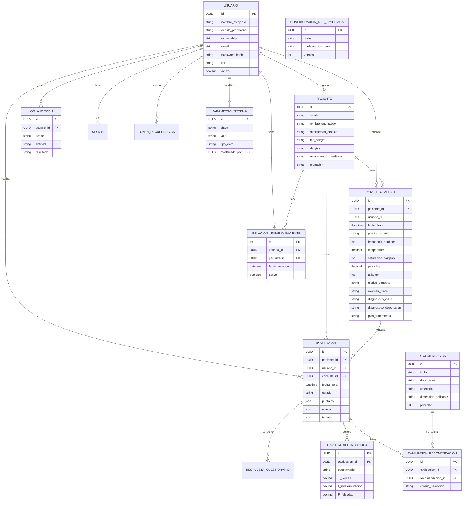

# Documentación del Modelo de Datos

Este documento detalla la estructura del modelo de datos utilizado en la API RESTful de Salud Mental. El sistema utiliza una base de datos relacional (SQL Server) gestionada a través de JPA/Hibernate.

## 🗺️ Diagrama Entidad-Relación

## 📚 Descripción de Entidades

### 1. Usuario (`usuarios`)
Representa a los profesionales médicos o administradores del sistema.
*   **id**: UUID (PK).
*   **cedula_profesional**: Identificador único del profesional (Unique).
*   **email**: Correo electrónico para acceso (Unique).
*   **password_hash**: Contraseña encriptada.
*   **rol**: Rol del usuario (`ADMIN`, `USUARIO`).
*   **activo**: Estado de la cuenta.

### 2. Paciente (`pacientes`)
Individuos que reciben atención y evaluaciones. La relación con médicos se gestiona a través de `relacion_usuario_paciente`.
*   **id**: UUID (PK).
*   **cedula**: Identificación única del paciente.
*   **nombre_encriptado**: Nombre del paciente almacenado de forma segura.
*   **enfermedad_cronica**: Antecedentes médicos relevantes.
*   **tipo_sangre**: Tipo de sangre del paciente (A+, B-, O+, etc.).
*   **alergias**: Alergias conocidas del paciente.
*   **antecedentes_familiares**: Historial médico familiar.
*   **ocupacion**: Ocupación/profesión del paciente.

### 3. ConsultaMedica (`consultas_medicas`)
Registro de una consulta médica general, actúa como puente entre Paciente y Evaluación.
*   **id**: UUID (PK).
*   **paciente_id**: FK al paciente atendido.
*   **usuario_id**: FK al médico que atiende.
*   **fecha_hora**: Fecha y hora de la consulta.
*   **Signos Vitales (Triaje)**:
    *   `presion_arterial`: Presión arterial (ej: "120/80").
    *   `frecuencia_cardiaca`: Frecuencia cardíaca en bpm.
    *   `temperatura`: Temperatura corporal en °C.
    *   `saturacion_oxigeno`: Saturación de oxígeno en %.
    *   `peso_kg`: Peso en kilogramos.
    *   `talla_cm`: Talla en centímetros.
*   **Evolución Clínica**:
    *   `motivo_consulta`: Razón de la visita (requerido).
    *   `examen_fisico`: Hallazgos del examen físico.
    *   `diagnostico_cie10`: Código CIE-10 del diagnóstico.
    *   `diagnostico_descripcion`: Descripción del diagnóstico.
    *   `plan_tratamiento`: Plan de tratamiento propuesto.

### 4. RelacionUsuarioPaciente (`relacion_usuario_paciente`)
Tabla de relación muchos-a-muchos entre usuarios (doctores) y pacientes. Permite que un paciente sea atendido por múltiples doctores (ej. referidos).
*   **id**: Integer (PK, auto-increment).
*   **usuario_id**: FK al doctor.
*   **paciente_id**: FK al paciente.
*   **fecha_relacion**: Fecha en que se estableció la relación.
*   **activo**: Si la relación está activa o fue desactivada.

### 5. Evaluacion (`evaluaciones`)
Registro central de una sesión de evaluación psicológica.
*   **paciente_id**: Paciente evaluado.
*   **usuario_id**: Profesional que realiza la evaluación.
*   **consulta_id**: FK opcional a la consulta médica asociada.
*   **Puntajes**: `gad7_puntaje`, `phq9_puntaje`, `pss10_puntaje`.
*   **Niveles**: `nivel_ansiedad`, `nivel_depresion`, `nivel_estres`.
*   **Tripletas Globales**: Almacena los valores T, I, F calculados finales para cada dimensión.
*   **Probabilidades**: `prob_adherencia_alta`, `media`, `baja`.

### 4. Recomendacion (`recomendaciones`)
Banco de recomendaciones disponibles para ser asignadas.
*   **dimension_aplicable**: Área a la que aplica (Ansiedad, Depresión, Estrés).
*   **nivel_minimo/maximo**: Rango de severidad para el cual es aplicable.
*   **evidencia_cientifica**: Referencias o justificación.

### 5. EvaluacionRecomendacion (`evaluaciones_recomendaciones`)
Tabla intermedia que asigna recomendaciones específicas a una evaluación realizada.
*   **criterio_seleccion**: Razón por la cual se seleccionó esta recomendación.
*   **orden_presentacion**: Orden sugerido para el paciente.

### 6. TripletaNeutrosofica (`tripletas_neutrosoficas`)
Almacena los valores detallados de lógica neutrosófica por ítem.
*   **cuestionario**: Instrumento (GAD7, PHQ9, etc.).
*   **numero_item**: Pregunta específica.
*   **Valores**: `T_verdad`, `I_indeterminacion`, `F_falsedad`.

### 7. RespuestaCuestionario (`respuestas_cuestionarios`)
Respuestas crudas (raw data) de los tests.
*   **respuesta**: Valor numérico seleccionado por el paciente.

### 8. ParametroSistema (`parametros_sistema`)
Configuraciones dinámicas del sistema.
*   **clave**: Identificador único de la configuración.
*   **valor**: Valor de la configuración (stored as String).
*   **tipo_dato**: Tipo para castear el valor (INTEGER, BOOLEAN, STRING).

### 9. LogAuditoria (`logs_auditoria`)
Registro de seguridad y trazabilidad.
*   **accion**: Qué se hizo (LOGIN, CREATE, UPDATE).
*   **entidad**: Sobre qué recurso.
*   **ip_address**: Origen de la petición.

### 10. ConfiguracionRedBayesiana (`configuracion_red_bayesiana`)
Configuraciones versionadas para el motor de inferencia.
*   **nodo**: Nodo de la red.
*   **configuracion_json**: Definición de la estructura/probabilidades.
*   **version**: Control de versiones de la configuración.

### 11. Sesion (`sesiones`)
Control de sesiones activas y tokens de refresco.

### 12. TokenRecuperacion (`tokens_recuperacion`)
Tokens temporales para recuperación de contraseñas.
